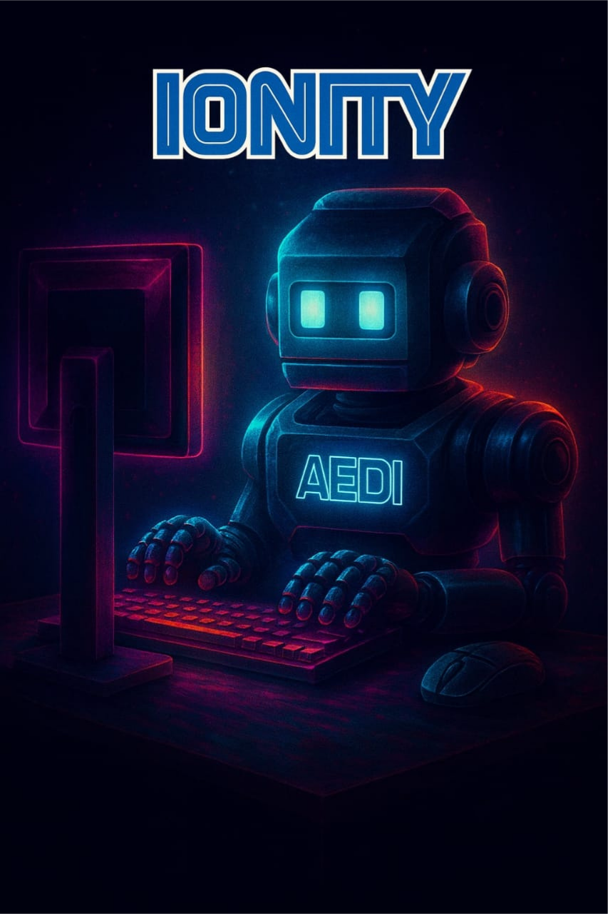
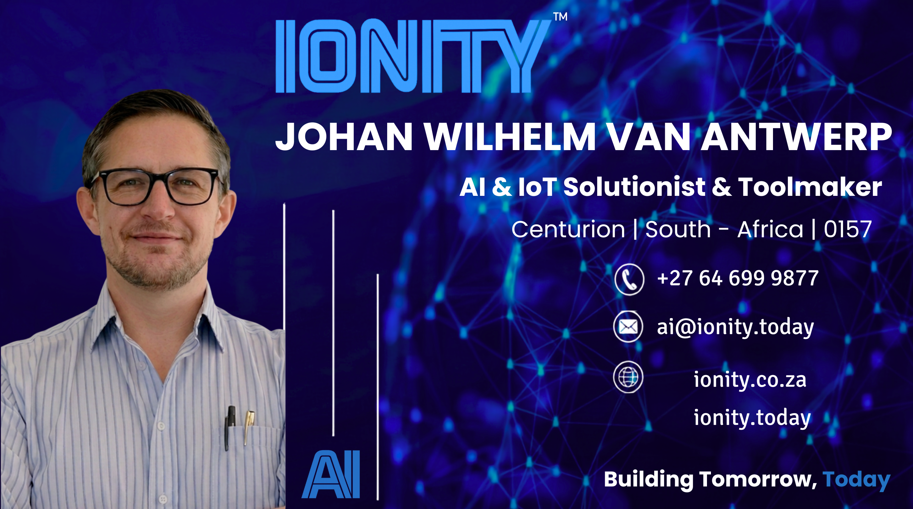

# ⚡ Ionity Central

<div align="center">



### Enterprise Unified Workspace · Commercial CRM Pipeline · Agile SCRUM Engine  
### Moveable Video Camera · P2P Screenshare · Paddle OCR AI · On-Device Local Tiny AI

[](https://ionity-root-system.web.app)
[](https://www.ionity.today)
[](cloudhardware.txt)
[](LICENSE)
[](.github/workflows/firebase-deploy.yml)

**Architected & Authored by Johan Wilhelm van Antwerp**  
*Solutionist of Antwerp Designs • Ionity Global (Pty) Ltd*  
Official Websites: [www.ionity.today](https://www.ionity.today) | [www.ionity.co.za](https://www.ionity.co.za)

</div>

---

## 🏛️ Executive Overview

**Ionity Central** is a high-performance, zero-latency progressive enterprise platform hosted **100% free** across Firebase Web Hosting and Google Cloud Compute Engine (Always-Free Tier). It combines:

- 📄 **Unity 2.0 Workspace** — Modular document blocks, Markdown import/export, focus timer, retro badge metadata
- 💰 **4-Stage Commercial CRM** — Check-in → Quoted → Followed Up → Paid/Won with AI proposal generation
- ⚡ **Agile SCRUM Sprint Hub** — Kanban board, burndown metrics, velocity tracking
- 📹 **Moveable Video Camera & P2P Screenshare** — Draggable PiP, WebRTC mesh, screen recorder with watermark
- 🔍 **Paddle OCR AI Vision Inspector** — On-screen OCR scanning with AI reporting
- 🌊 **Watermark Studio** — Composite retro watermark overlay for recorded media
- 👤 **Profiles & Signatures** — Team member profiles with signature assets
- 🧠 **Local Tiny AI & Semantic RAG Vector Cache** — On-device Chrome AI / Gemini Nano, 0 tokens, 0ms latency

```
+---------------------------------------------------------------------------------------------+
|                                    IONITY CENTRAL                                           |
+---------------------------------------------------------------------------------------------+
|  [ UNITY 2.0 DOCS ]   [ 4-STAGE CRM ]    [ SCRUM KANBAN ]    [ P2P SCREENSHARE & CAM ]     |
|  - Dynamic Blocks     - Check-in          - Backlog           - Floating Draggable Widget   |
|  - Markdown Import    - Quoted            - ⚡ Busy With      - 1-Click Left Corner Dock    |
|  - Live Focus Timer   - Followed Up       - ✅ Completed      - WebRTC Mesh (0 Firebase)    |
|  - Retro Badge Meta   - Paid / Won        - Burndown Chart    - VM Session Ledger Log       |
+---------------------------------------------------------------------------------------------+
|  [ PADDLE OCR AI ]    [ WATERMARK STUDIO ]  [ PROFILES & SIGS ]  [ SCREEN RECORDER ]       |
|  - 1-Click Screen OCR - Retro Composite     - Team Avatars        - Live Recording          |
|  - AI Vision Report   - Ionity Branding     - Signature Library   - Custom Watermark        |
+---------------------------------------------------------------------------------------------+
|                    [ LOCAL TINY AI & SEMANTIC RAG CACHE ENGINE ]                            |
|  • On-Device Chrome window.ai / Gemini Nano + In-Cache Neural Fallback (0ms, 0 Tokens)     |
|  • Local Vector Index across Docs, Deals & Tasks with 1-Click Backup to Free Cloud VM      |
+---------------------------------------------------------------------------------------------+
|                              [ CLOUD HOSTING & IDENTITY ]                                   |
|  • Firebase Web Hosting (Spark Free Tier) — 10GB Global Edge Storage & Let's Encrypt        |
|  • Google Cloud Always-Free e2-micro VM (us-central1-a) + 30GB Disk + 2GB Swap Memory      |
|  • Google OAuth 2.0 Identity Services — Domain Gate Restricted to @ionity.today             |
+---------------------------------------------------------------------------------------------+
```

---

## 🗂️ Repository File Tree

```
ionity-central/
├── index.html                   # Main PWA entry point
├── manifest.json                # PWA Web App Manifest
├── sw.js                        # Service Worker (offline cache)
├── favicon.ico                  # Site favicon
├── LICENSE                      # Apache 2.0 License
├── README.md                    # This file
├── DEPLOYMENT_GUIDE.md          # Complete cloud deployment guide
├── cloudhardware.txt            # GCP Always-Free tier hardware log
├── nginx.conf                   # Nginx reverse-proxy configuration
├── Dockerfile                   # Container build definition
├── firebase.json                # Firebase Hosting configuration
├── .firebaserc                  # Firebase project aliases
├── deploy-firebase.sh           # Linux/macOS Firebase deploy script
├── deploy-firebase.ps1          # Windows PowerShell Firebase deploy
├── deploy-gcp.sh                # GCP VM bootstrap script
│
├── assets/                      # Brand assets & media
│   ├── ionity-logo.png          # Ionity logo (raster)
│   ├── ionity-logo-vector.svg   # Ionity logo (vector SVG)
│   ├── aedi.svg                 # AEDi / Antwerp Designs banner
│   ├── AEDi-AntwerpDesigns-Ionityglobal.png
│   ├── ionity-card-electric.gif # Animated card asset
│   ├── johan-avatar.jpg         # Author avatar
│   └── Johanwilhelmvanantwerpesignatureionity.png
│
├── icons/                       # PWA icons
│   ├── icon-192.png
│   └── icon-512.png
│
├── css/                         # Modular stylesheets
│   ├── main.css                 # Global tokens, layout, typography
│   ├── workspace.css            # Unity 2.0 block editor styles
│   ├── crm.css                  # CRM pipeline styles
│   ├── scrum.css                # SCRUM kanban styles
│   ├── components.css           # Shared UI components
│   ├── auth-screen.css          # Authentication screen
│   ├── screenshare.css          # P2P screenshare & camera widget
│   └── ocr-inspector.css        # OCR vision inspector overlay
│
├── js/                          # Application modules
│   ├── app.js                   # Core app bootstrap, routing, keyboard shortcuts
│   ├── auth.js                  # Google OAuth 2.0 domain-gated authentication
│   ├── workspace.js             # Unity 2.0 block editor engine
│   ├── crm.js                   # 4-Stage CRM pipeline
│   ├── scrum.js                 # SCRUM kanban board & metrics
│   ├── screenshare.js           # WebRTC P2P screenshare & camera
│   ├── recorder.js              # Screen recording with watermark composite
│   ├── watermark.js             # Watermark Studio renderer
│   ├── ocr-inspector.js         # Paddle OCR AI vision inspector
│   ├── profiles.js              # Team profiles & signature assets
│   ├── local-rag.js             # Semantic RAG vector cache engine
│   ├── gemini-service.js        # Gemini AI API + Cache AUC service
│   ├── firebase-manager.js      # Firebase SDK controller & cloud sync
│   ├── gcp-helper.js            # GCP Always-Free helper & terminal sim
│   ├── notifications.js         # Toast & push notification manager
│   ├── storage.js               # LocalStorage / IndexedDB persistence
│   ├── icons.js                 # SVG icon registry
│   └── tab-sync.js              # Real-time BroadcastChannel tab sync
│
├── wiki/                        # In-repo documentation wiki
│   ├── Home.md                  # Wiki index & navigation
│   ├── Architecture.md          # Cloud topology & system design
│   ├── CRM-Pipeline.md          # 4-Stage CRM guide
│   ├── SCRUM-Sprint.md          # SCRUM kanban & sprint guide
│   ├── OCR-Inspector.md         # Paddle OCR AI vision guide
│   ├── Watermark-Studio.md      # Watermark Studio guide
│   ├── Local-AI-and-RAG.md      # Local Tiny AI & RAG cache guide
│   ├── P2P-Screenshare-and-Webcam.md  # P2P screenshare & camera guide
│   ├── Security-and-Auth.md     # Google OAuth 2.0 & security guide
│   ├── PWA-and-Manifest.md      # PWA, service worker & manifest guide
│   └── Deployment-Guide.md      # Firebase & GCP deployment guide
│
├── tools/                       # Automation & tooling
│   ├── deploy-gcp-vm.ps1        # PowerShell GCP VM provisioner
│   └── setup-webssh-ttyd.sh     # In-browser WebSSH (ttyd) installer
│
└── .github/
    └── workflows/
        └── firebase-deploy.yml  # GitHub Actions CI/CD auto-deploy
```

---

## 🛠️ Complete Software Stack

| Layer | Technologies | Highlights |
|---|---|---|
| **Core Client** | Vanilla JavaScript (ES2024), HTML5 | Zero framework bloat, sub-50ms TTI |
| **Design System** | Vanilla CSS3, Glassmorphism, Micro-animations | Canvas `#1A1A1A`, Accent `#3366FF`, Retro `#FFA000` |
| **PWA** | Web App Manifest, Service Worker, `sw.js` | Offline support, installable, home screen icon |
| **Media & Streaming** | WebRTC, `adapter.js`, `MediaRecorder`, BroadcastChannel | Direct P2P screenshare + moveable webcam PiP |
| **OCR Vision** | Paddle OCR engine (browser-side), AI Vision Reporter | 1-click on-screen text extraction & AI analysis |
| **On-Device AI** | Chrome Built-in AI (`window.ai` / Gemini Nano) | 100% in-cache on-device inference, 0 network tokens |
| **Semantic RAG** | Vector Chunking, Inverted TF-IDF / BM25 Index | Indexes Unity docs, CRM deals, SCRUM backlog |
| **Cloud AI** | Google AI Studio Gemini API (`gemini-1.5-flash`, `gemini-2.0-flash`) | Cache AUC for 0ms token caching |
| **Identity** | Google Identity Services (GSI), JWT decode, Domain Gate | Strictly restricted to `@ionity.today` / `@ionity.co.za` |
| **Edge Hosting** | Firebase Hosting 10.13.0, Spark Free Tier, Global CDN | 10GB Free Storage, 360MB/day transfer, custom domain SSL |
| **Cloud VM** | GCP Compute Engine `e2-micro` (Ubuntu 24.04 LTS) | Always Free Tier `us-central1-a`, 30GB disk, 2GB swap |
| **Web Server** | Nginx 1.26+, Let's Encrypt Certbot, UFW Firewall | HTTP/2, Gzip, immutable PWA asset caching |

---

## 🚀 Key Modules & Capabilities

### 1. 📄 Unity 2.0 Workspace
- **Dynamic Block System**: Text headings (H1/H2/H3), bullet lists, checklists, syntax-highlighted code blocks, callouts, and dynamic tables.
- **Markdown Importer/Exporter**: 1-click import of `.md` specs and real-time Markdown exporting.
- **Cover & Icon Studio**: Custom vector SVG icons and retro geometric patterns with live preview.
- **Focus Timer**: Pomodoro-style live focus timer embedded in document header.
- **Deep AI Context**: Documents automatically indexed into the local RAG knowledge base for AI-enriched query responses.

### 2. 💰 4-Stage Commercial CRM Pipeline
- **Financial Lifecycle**: `Check-in` ➔ `Quoted` ➔ `Followed Up` ➔ `Paid / Won`.
- **Dynamic SVG Telemetry**: Real-time pipeline value forecasting and stage probability calculation.
- **AI Proposal Generator**: 1-click commercial scope and financial milestone proposals via Gemini AI.
- **Deal Cards**: Rich deal cards with contact info, value, stage probability, and activity log.

### 3. ⚡ Agile SCRUM Sprint Hub
- **Sprint Kanban**: Backlog, `⚡ Busy With` (active sprint), and `✅ Completed` (reference stories).
- **Metrics Dashboard**: Automated story point burndown and velocity tracking.
- **Acceptance Criteria**: Structured user stories with definition-of-done checklists.

### 4. 📹 Moveable Video Camera & P2P Screenshare
- **Draggable Camera PiP**: Freely moveable floating viewport with bounds clamping and glassmorphism.
- **📍 Default Left Corner Snap**: Instant docking to bottom-left with 1 click or `Ctrl+Shift+S`.
- **⛶ 1-Click Fullscreen**: Toggle to full workspace dimensions (`100vw` / `100vh`).
- **🔴 Integrated Screen Recorder**: Live screen/camera recording with retro watermark composite.
- **⚡ 100% P2P Streaming**: WebRTC & BroadcastChannel mesh — zero Firebase storage/bandwidth consumed.
- **☁️ VM Session Ledger**: Active sessions register `GCP-VM-SESS-XXXX` on the Always-Free GCP VM.

### 5. 🔍 Paddle OCR AI Vision Inspector
- **1-Click Screen OCR**: Captures and scans the current viewport for text using the Paddle OCR engine.
- **AI Vision Reporter**: Extracted text is automatically analyzed and reported by the Gemini AI service.
- **Overlay Inspector**: Non-destructive floating overlay panel with detected text regions and confidence scores.

### 6. 🌊 Watermark Studio
- **Retro Composite Watermark**: Applies the Ionity Global brand watermark over recorded video frames.
- **Custom Overlay**: Configurable opacity, position, and scale for the watermark badge.
- **Live Preview**: Real-time canvas preview before applying to export.

### 7. 👤 Profiles & Signatures
- **Team Member Profiles**: Avatar, name, role, and organization stored per-session.
- **Signature Library**: Official signature assets for Johan Wilhelm van Antwerp and team members.
- **Profile Switching**: Seamless switching between user profiles in the workspace.

### 8. 🧠 Local Tiny AI & Semantic RAG Vector Cache
- **Local Tiny AI (In-Cache / Nano)**: On-device via `window.ai` / Gemini Nano (0 network calls, 0ms latency).
- **Local RAG Vector Cache**: BM25/TF-IDF chunking and indexing of all workspace entities.
- **☁️ 1-Click VM Backup**: RAG vector knowledge backed up to Always-Free GCP VM and `gs://ionity-storage-root/rag-cache.json`.

### 9. 🔑 Remote SSH Terminal & WebSSH Bridge
- **1-Click Google Cloud Web SSH**: Opens Google Web SSH directly into `ionity-central-vm`.
- **CLI SSH**: Copy-ready `gcloud compute ssh` and direct `ssh root@<IP>` commands.
- **In-Browser WebSSH (ttyd)**: Automated installer (`tools/setup-webssh-ttyd.sh`) for interactive browser terminals.

### 10. 🔔 Real-Time Notifications & Tab Sync
- **Toast Notifications**: Non-blocking status toasts for all async operations.
- **BroadcastChannel Tab Sync**: Multi-tab real-time state synchronization across open workspace tabs.
- **PWA Push Notifications**: Native OS-level push notifications (when installed as PWA).

---

## 💻 Local Development Setup

```bash
# 1. Clone the repository
git clone https://github.com/Ionity-Global-Pty-Ltd/ionity-central.git
cd ionity-central

# 2. Start a local static server (no build step required)
python -m http.server 8080
# or
npx serve . -p 8080
# or
npx http-server . -p 8080
```

Open your browser at: **`http://127.0.0.1:8080/`**

> **Note**: Google OAuth requires a registered origin. For local development, add `http://localhost:8080` to your OAuth 2.0 Client ID's authorized JavaScript origins in Google Cloud Console, or use the 1-Click Demo Login which bypasses OAuth for local testing.

---

## ☁️ Deployment Guide

### Option A: Deploy to Firebase Web Hosting (Recommended)

```powershell
# Windows PowerShell (1-click)
.\deploy-firebase.ps1
```

```bash
# Linux / macOS
bash deploy-firebase.sh
```

Production URL: **`https://ionity-root-system.web.app`**

### Option B: Provision Always-Free Google Cloud VM

```powershell
# Windows
.\tools\deploy-gcp-vm.ps1 -ProjectId "ionity-root-system" -Zone "us-central1-a"
```

The script automatically:
1. Enables Compute Engine and Cloud Storage APIs.
2. Configures UFW firewall rules (Ports 22, 80, 443).
3. Creates a 5GB Standard Cloud Storage bucket.
4. Provisions an `e2-micro` VM with a 30GB Standard Persistent Disk in `us-central1-a`.
5. Uploads application files and runs `deploy-gcp.sh` — configuring a **2GB swapfile**, Nginx reverse proxy, and Let's Encrypt SSL.

### Option C: GitHub Actions CI/CD Auto-Deploy

Push to `main` triggers `.github/workflows/firebase-deploy.yml` for automatic Firebase deployment.

```
git push origin main   # → triggers auto-deploy via GitHub Actions
```

---

## ⚙️ Configuration

### Google OAuth 2.0 Client ID
1. Go to [Google Cloud Console → APIs & Services → Credentials](https://console.cloud.google.com/apis/credentials).
2. Create an OAuth 2.0 Web Client ID.
3. Add your deployment URLs as authorized JavaScript origins.
4. Paste the Client ID into the app's **"⚙️ Set Custom Google Client ID"** panel at the login screen.

### Gemini AI API Key
1. Get a free key at [aistudio.google.com](https://aistudio.google.com).
2. Paste it into the **Local AI** settings panel in the app.
3. The Cache AUC engine automatically caches repeated queries for 0-token retrieval.

### Firebase Project
Update `.firebaserc` with your Firebase project ID:
```json
{
  "projects": {
    "default": "your-firebase-project-id"
  }
}
```

---

## 🎨 Design System

| Token | Value | Usage |
|---|---|---|
| `--bg-primary` | `#1A1A1A` | Canvas / workspace background |
| `--text-primary` | `#FFFFFF` | Primary text |
| `--accent-blue` | `#3366FF` | Primary action color |
| `--accent-gold` | `#FFA000` | Retro 8-bit accent |
| `--status-green` | `#00E676` | Active / live status |
| `--status-red` | `#FF3D71` | Recording / error state |
| `--glass-border` | `rgba(255,255,255,0.08)` | Glassmorphism borders |

Typography: System-native monospace (`"SF Mono"`, `"Fira Code"`, `Consolas`, `monospace`) for all code/data; system sans-serif for prose.

---

## 📚 Documentation & Wiki

Full documentation lives in the [`wiki/`](wiki/) directory:

| Document | Description |
|---|---|
| [🏠 Wiki Home](wiki/Home.md) | Navigation index for all wiki pages |
| [🏛️ Architecture](wiki/Architecture.md) | Cloud topology, dual-tier hosting, system design |
| [💰 CRM Pipeline](wiki/CRM-Pipeline.md) | 4-Stage CRM guide, deal management & AI proposals |
| [⚡ SCRUM Sprint Hub](wiki/SCRUM-Sprint.md) | Kanban board, story points, burndown metrics |
| [🔍 OCR Inspector](wiki/OCR-Inspector.md) | Paddle OCR AI vision scanning & reporting |
| [🌊 Watermark Studio](wiki/Watermark-Studio.md) | Watermark composite & recording overlay |
| [🧠 Local AI & RAG](wiki/Local-AI-and-RAG.md) | On-device Tiny AI, RAG vector cache, VM backup |
| [📹 P2P Screenshare](wiki/P2P-Screenshare-and-Webcam.md) | WebRTC mesh, moveable camera, session logger |
| [🔒 Security & Auth](wiki/Security-and-Auth.md) | Google OAuth 2.0, domain gate, security headers |
| [📱 PWA & Manifest](wiki/PWA-and-Manifest.md) | Service worker, offline cache, install prompts |
| [🚀 Deployment Guide](wiki/Deployment-Guide.md) | Firebase & GCP VM step-by-step deployment |

---

## 🤝 Contributing

See [CONTRIBUTING.md](CONTRIBUTING.md) for contribution guidelines, branching strategy, and code style.

---

## 👤 Author & Organization

| Field | Detail |
|---|---|
| **Author** | Johan Wilhelm van Antwerp |
| **Role** | Solutionist, Antwerp Designs |
| **Organization** | Ionity Global (Pty) Ltd |
| **Portals** | [www.ionity.today](https://www.ionity.today) · [www.ionity.co.za](https://www.ionity.co.za) |
| **Brand Signature** |  |

---

## 📜 License

Licensed under the [Apache License, Version 2.0](LICENSE).  
Copyright © 2026 Ionity Global (Pty) Ltd & Antwerp Designs. All rights reserved.
