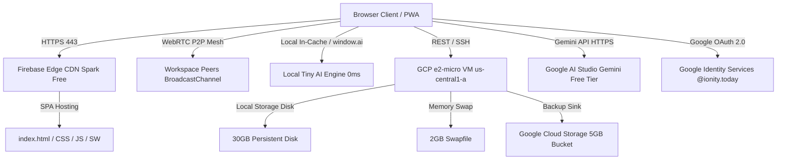

# 🏛️ Ionity Central System Architecture

Ionity Central operates on a zero-cost, high-reliability dual-cloud architecture designed for indefinite free operation under Google Cloud Platform Free Tier and Firebase Spark limits.

---

## System Topology Diagram



---

## Cloud Tiers

### Tier 1: Compute Engine (e2-micro Always Free)

| Spec | Value |
|---|---|
| **Machine Type** | `e2-micro` (2 shared vCPUs, 1.0 GB RAM) |
| **Region** | `us-central1-a` (Iowa — mandatory for Always Free) |
| **Storage** | 30 GB Standard Persistent Disk (`pd-standard`) |
| **Swap** | 2.0 GB Swapfile (`/swapfile`) for OOM prevention |
| **OS** | Ubuntu 24.04 LTS |
| **Web Server** | Nginx 1.26+ with HTTP/2, Gzip, and immutable asset caching |
| **SSL** | Certbot auto-renewing Let's Encrypt certificates |
| **Firewall** | UFW — Ports 22 (SSH), 80 (HTTP), 443 (HTTPS) |
| **Cost** | **$0.00 / month** |

### Tier 2: Firebase Web Hosting (Spark Free)

| Spec | Value |
|---|---|
| **Edge Storage** | 10 GB (free forever) |
| **Transfer** | 360 MB/day (~10 GB/month) |
| **CDN** | Google Cloud Global Anycast |
| **SSL** | Automated Let's Encrypt for custom domains |
| **Custom Domains** | `central.ionity.today`, `central.ionity.co.za` |
| **Primary URL** | `https://ionity-root-system.web.app` |
| **Cost** | **$0.00 / month** |

### Tier 3: Google Cloud Storage (Free Tier)

| Spec | Value |
|---|---|
| **Storage** | 5.0 GB-months Standard Storage |
| **Operations** | 5,000 Class A (writes) / 50,000 Class B (reads) per month |
| **Usage** | RAG vector cache backup (`gs://ionity-storage-root/rag-cache.json`) |
| **Cost** | **$0.00 / month** |

### Tier 4: Google Gemini AI (Google AI Studio Free Tier)

| Spec | Value |
|---|---|
| **Models** | `gemini-1.5-flash`, `gemini-2.0-flash`, `gemini-1.5-pro` |
| **Rate Limit** | 15 RPM, 1,000,000 TPM, 1,500 RPD |
| **Cache AUC** | Active Universal Cache — IndexedDB hash-based context caching |
| **Cost** | **$0.00 / month** |

### Tier 5: P2P Screenshare & Camera (Zero Firebase Bandwidth)

| Spec | Value |
|---|---|
| **Transport** | Direct WebRTC DataChannels + BroadcastChannel mesh |
| **Firebase Usage** | 0% — all streaming is peer-to-peer |
| **Session Logger** | GCP Always-Free VM edge telemetry (`GCP-VM-SESS-XXXX`) |
| **Cost** | **$0.00 / month** |

### Tier 6: Local Tiny AI & RAG Cache

| Spec | Value |
|---|---|
| **On-Device Engine** | `window.ai` (Chrome Gemini Nano) or in-cache neural fallback |
| **Latency** | 0ms (fully local) |
| **Token Usage** | 0 tokens from cloud quota |
| **Vector Index** | BM25/TF-IDF over Unity docs, CRM deals, SCRUM backlog |
| **Cloud Backup** | 1-Click to Always-Free VM + GCS bucket |
| **Cost** | **$0.00 / month** |

---

## Authentication Flow

```
Browser ──► Google Identity Services (GSI)
              │
              ▼
         JWT Credential Token
              │
              ▼
         js/auth.js Domain Gate
          ├── @ionity.today ──► ✅ Access Granted
          ├── @ionity.co.za ──► ✅ Access Granted
          └── Other domains ──► ⛔ Access Denied
```

---

## Module Dependency Map

```
index.html
 ├── js/app.js           ← Core bootstrap, routing, keyboard shortcuts
 │    ├── js/auth.js     ← Google OAuth 2.0, domain gate, session
 │    ├── js/workspace.js ← Unity 2.0 block editor
 │    ├── js/crm.js      ← 4-Stage CRM pipeline
 │    ├── js/scrum.js    ← SCRUM kanban & metrics
 │    ├── js/screenshare.js ← WebRTC P2P, camera PiP
 │    ├── js/recorder.js ← Screen recorder + watermark
 │    ├── js/watermark.js ← Watermark canvas composite
 │    ├── js/ocr-inspector.js ← Paddle OCR + AI reporter
 │    ├── js/profiles.js ← Team profiles & signatures
 │    ├── js/local-rag.js ← Semantic RAG vector cache
 │    ├── js/gemini-service.js ← Gemini AI + Cache AUC
 │    ├── js/firebase-manager.js ← Firebase SDK controller
 │    ├── js/gcp-helper.js ← GCP helper & terminal sim
 │    ├── js/notifications.js ← Toast & push notifications
 │    ├── js/storage.js  ← localStorage / IndexedDB
 │    ├── js/icons.js    ← SVG icon registry
 │    └── js/tab-sync.js ← BroadcastChannel tab sync
 └── sw.js               ← Service worker (offline cache)
```

---

## Security Architecture

See [Security & Auth Guide](Security-and-Auth.md) for full details.

- **Transport**: HTTPS everywhere (Firebase CDN + Nginx + Let's Encrypt)
- **Authentication**: Google OAuth 2.0 with strict domain allowlist
- **Headers**: HSTS, X-Frame-Options, X-Content-Type-Options, X-XSS-Protection
- **P2P**: All screenshare traffic is direct browser-to-browser (never touches Firebase)
- **AI Data**: Text-only data sent to Gemini API; no images or credentials transmitted
