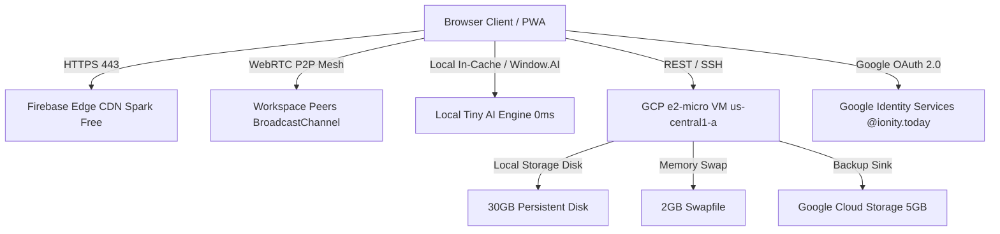

# 🏛️ Ionity Central System Architecture

Ionity Central operates on a zero-cost, high-reliability dual-cloud architecture designed for indefinite free operation under Google Cloud Platform Free Tier and Firebase Spark limits.

## Cloud Tiers

### 1. Compute Engine (e2-micro Always Free)
- **Region**: `us-central1-a` (Iowa)
- **vCPU**: 2 shared vCPUs
- **RAM**: 1.0 GB physical RAM + **2.0 GB swapfile** (`/swapfile`)
- **Storage**: 30 GB standard persistent disk (`/dev/sda1`)
- **Cost**: $0.00 / month indefinitely

### 2. Firebase Web Hosting (Spark Free)
- **Edge Storage**: 10 GB
- **Transfer**: 360 MB/day (~10 GB/month)
- **SSL**: Automated Let's Encrypt certificates
- **Custom Domains**: `central.ionity.today`, `central.ionity.co.za`
- **Cost**: $0.00 / month

### 3. Google AI Studio (Gemini Free Tier)
- **Rate Limit**: 15 RPM, 1,000,000 TPM, 1,500 RPD
- **Cache AUC**: IndexedDB hash-based context caching (0 tokens for repeated queries)
